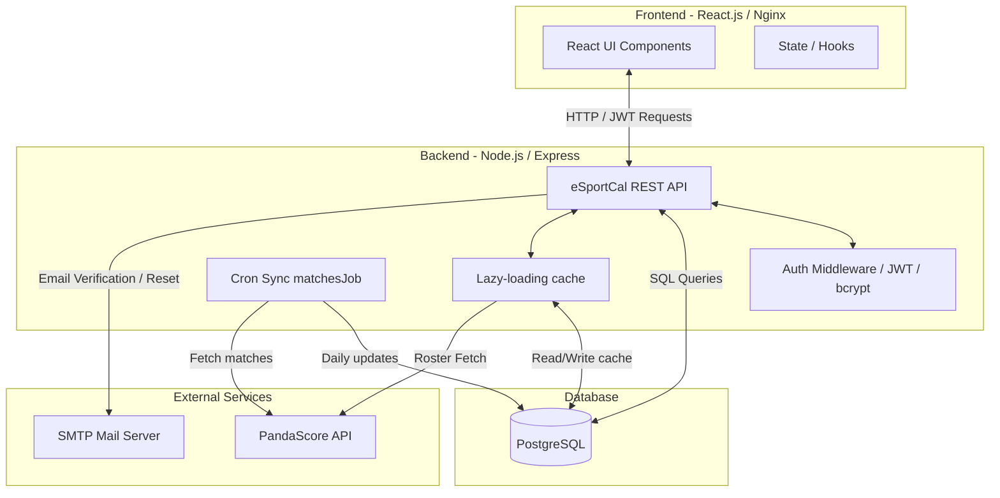
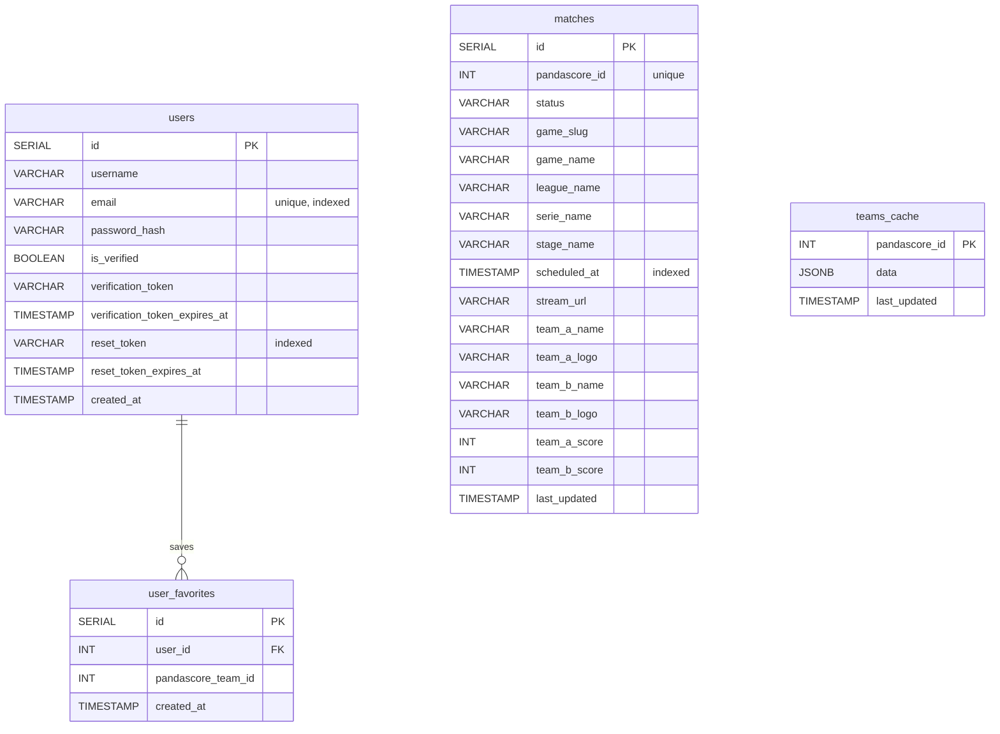

# 🎮 eSportCal


> A centralized, desktop-first web application that aggregates professional e-sport schedules into a single, highly filterable dashboard. 
> *Built as a final MVP Portfolio Project for Holberton School.*

## 📖 About The Project
E-sport fans currently struggle with fragmented data. They have to juggle between multiple wikis, social media, and streams to find match times. **eSportCal** solves this problem by providing a unified schedule, fetching 100% accurate, real-time match data using the PandaScore API.

### ✨ Key Features
- **Unified Schedule**: Real-time aggregation of professional matches (CS2, LoL, Valorant).
- **Dynamic Filtering**: Instantly sort matches by games, leagues, and specific teams.
- **Timezone Normalization**: Match times automatically adjust to the user's local timezone.
- **Favorites Engine**: Create an account to bookmark favorite teams and leagues.
- **Secure Authentication**: Stateless login system using JSON Web Tokens (JWT) and Bcrypt.
- **GDPR Compliant**: Full account and data deletion capabilities.

---

## 🛠️ Architecture & Tech Stack

Our application follows a standard decoupled Client-Server RESTful Architecture.

*   **Frontend**: React.js (Vite), Tailwind CSS, date-fns, react-router-dom.
*   **Backend**: Node.js, Express.js, Axios (Proxy pattern to protect API keys and manage rate limits).
*   **Database**: PostgreSQL (Relational mapping for Users and Favorites).
*   **External API**: PandaScore API.
*   **CI/CD**: GitHub Actions (Automated build and dependency checks).

### System Architecture Diagram


### Database Entity-Relationship Diagram (ERD)
Our database acts as a storage layer for user profiles and a local proxy cache for esports data to respect PandaScore API rate limits.



## 🚀 Getting Started (Local Development)
To run this project locally, you will need Node.js and PostgreSQL installed on your machine.

1. Database Setup
Open your PostgreSQL terminal/GUI.
Create a database named esportcal_db.
Run the SQL initialization script located in our documentation (or use the provided db.js migrations).

2. Backend Setup
```bash
# Navigate to the backend directory
cd backend

# Install dependencies
npm install

# Setup environment variables
cp .env.example .env
# -> Edit the .env file with your local DB credentials and PandaScore API Key

# Start the development server
npm run dev
```

> The backend should now be running on http://localhost:5001

3. Frontend Setup
Open a new terminal window:
```bash
# Navigate to the frontend directory
cd frontend

# Install dependencies
npm install

# Start the Vite development server
npm run dev
```
> The frontend should now be running on http://localhost:5173

---

## 📅 Development Roadmap
We are following an Agile methodology with rotating PM, SCM, and QA roles across 3 Sprints:


Sprint 1: The Foundation (Backend setup, PostgreSQL connection, PandaScore API Proxy).

Sprint 2: The Interface (React.js initialization, Tailwind CSS layout, Dynamic UI filtering).

Sprint 3: Security & Persistence (JWT Authentication, Favorites DB logic, E2E Testing).

---

## 👥 Authors

**Antoine** - Full-Stack Developer / DevOps - [GitHub](https://github.com/add1ktion)

**Ilan** - Full-Stack Developer / DevOps - [GitHub](https://github.com/Ilnnn)
